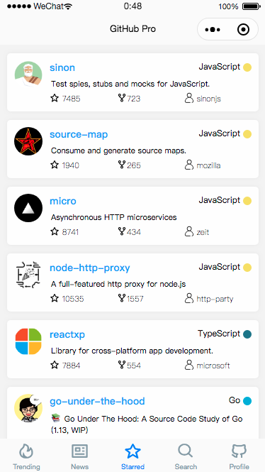
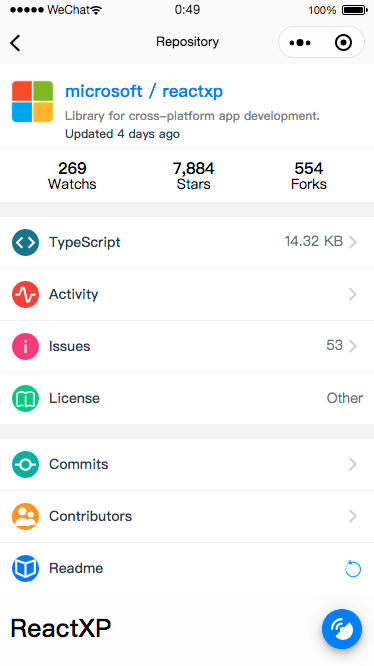

# GitHub Pro

 

> 一个简洁、强大的 GitHub 小程序客户端，基于 Taro 和 TypeScript。

## 启发

探究 Taro 使用 TypeScript 的坑，以及 Taro Hooks 的能力（所有页面、组件均用 Hooks） -- 结论： 真香~😋

## 扫码体验

(或者微信搜索小程序：GitHub Pro)

## Gif

## Screenshots

 
 
 

## Feature

TODO

## 协议

Copyright © 2019 zenghongtu