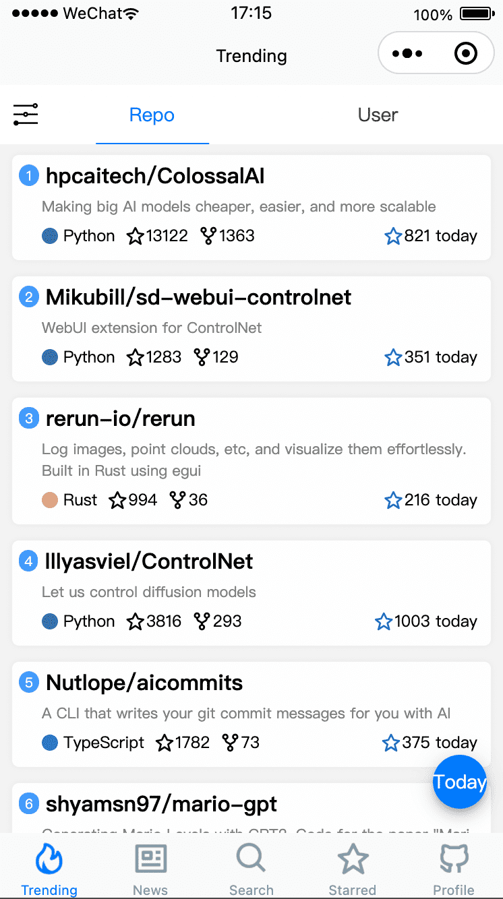
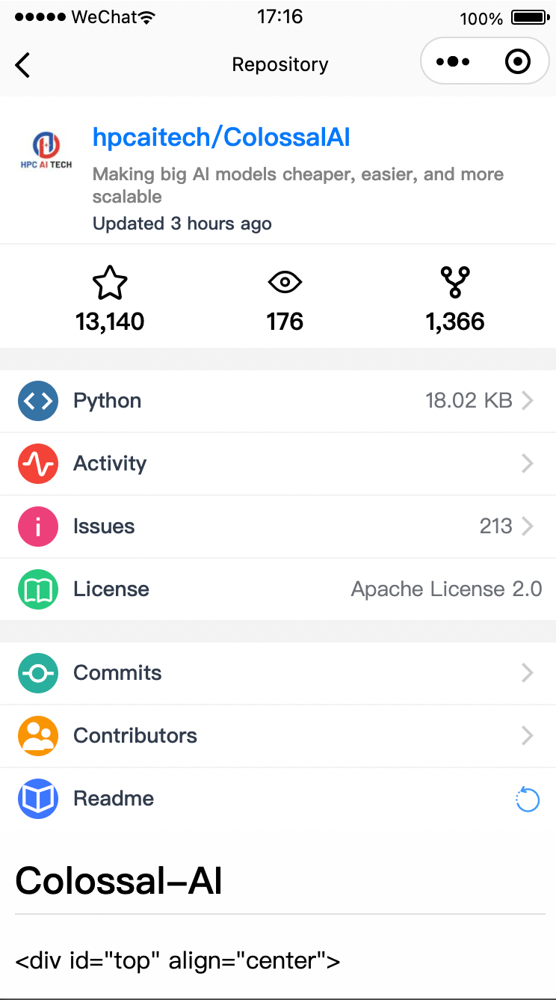
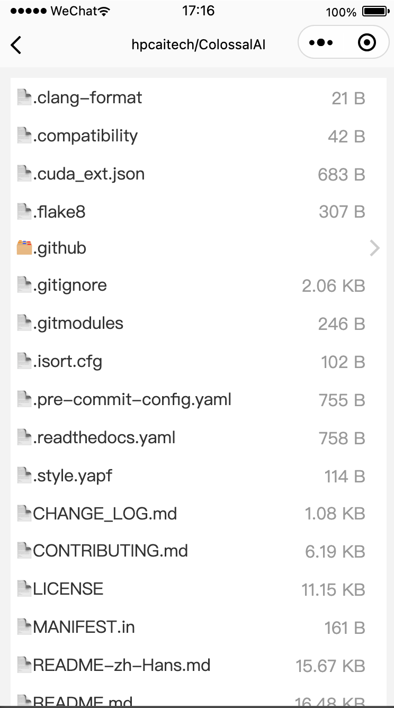
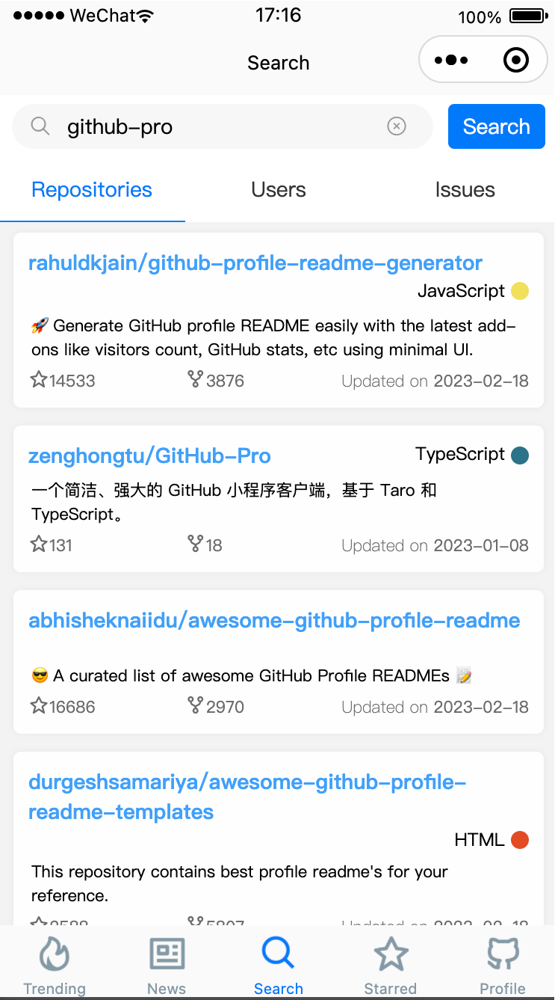
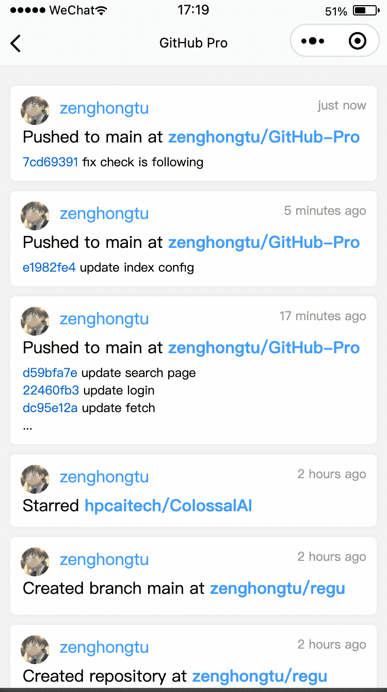

# GitHub Pro

 

> 一个简洁、强大的 GitHub 小程序客户端

基于 Taro3 / Taro-ui / React-query / React18 / **TypeScript**。

## 想法

探究 Taro 使用 TypeScript 的坑，以及 Taro Hooks 的能力（所有页面、组件均用 Hooks） -- 结论： 真香~😋

## 扫码体验

(或者微信搜索小程序：GitHub Pro)

## Preview

## Screenshots

|  |  |  |
| :---: | :---: | :---: |
||||
||||

## 协议

Copyright © 2023 zenghongtu
